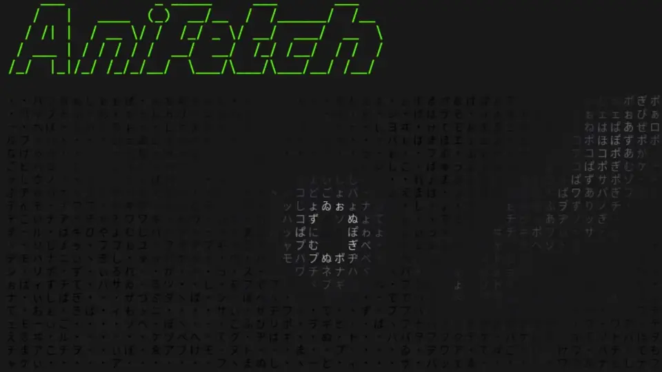

# Anifetch - Neofetch but animated.

This is a small tool built with neofetch/fastfetch, ffmpeg and chafa. It allows you to use neofetch or fastfetch while having animations.

## 🛠️ How to Install

### Prerequisites

Recommended Python version: 3.12 and later

You need the following tools installed on your system:

- `bc`

  - Debian/Ubuntu: `sudo apt install bc`
  - Arch: `sudo pacman -S bc`

- `chafa`

  - Debian/Ubuntu: `sudo apt install chafa`
  - [Other distros – Download Instructions](https://hpjansson.org/chafa/download/)

- `ffmpeg` (for video/audio playback)

  - Debian/Ubuntu: `sudo apt install ffmpeg`
  - [Other systems – Download](https://www.ffmpeg.org/download.html)

⚠️ Make sure `ffplay` is included in your `ffmpeg` installation (used for optional sound playback).

---

### ✅ Recommended Installation: via `pipx`

🔧 Make sure `pipx` is installed:

```bash
sudo apt install pipx
pipx ensurepath
```

and then:

```bash
pipx install git+https://github.com/Notenlish/anifetch.git
```

This installs `anifetch` in an isolated environment, keeping your system Python clean.
You can then run the `anifetch` command **directly in your terminal**.

Since pipx installs packages in an isolated environment, you won't have to worry about dependency conflicts or polluting your global python environment. `anifetch` will behave just like a native cli tool. You can upgrade your installation with `pipx upgrade anifetch`


---

### 👨‍💻 Developer Installation (for contributors): via `pip` in a virtual environment

```bash
git clone https://github.com/Notenlish/anifetch.git
cd anifetch
python3 -m venv venv
source venv/bin/activate
pip install -e .
```

This installs `anifetch` in **editable mode** within a local virtual environment for development.

You can then run the program in two ways:

- As a CLI: `anifetch`
- Or as a module: `python3 -m anifetch` (useful for debugging or internal testing)

⚠️ Please avoid using `pip install` outside a virtual environment on systems like Ubuntu.
This is restricted by [PEP 668](https://peps.python.org/pep-0668/) to protect the system Python.

## ▶️ How to Use It

You don't need to configure anything for `fastfetch` or `neofetch`. If they already work on your machine, `anifetch` will detect and use them automatically. Please note that one of these must be installed, otherwise anifetch won't work. To use **fastfetch**, you must append `-ff` to the anifetch command.

Place your video or gif file anywhere (e.g. your project folder). If you give a relative path then you must be in the correct folder. Anifetch is packaged with an `example.mp4` video by default. You can use that to test anifetch.

Any video file you give to anifetch will be stored in `~/.local/share/anifetch/assets` folder for linux and `C:\\Users\\[Username]\\AppData\\Local\\anifetch\\anifetch\\assets` folder for windows. After running `anifetch` with this video file once, next time use anifetch, you will be able to use that same video file in any location by just using its filename, since the video file has been saved in `/assets`.

### Example usage:

```bash
anifetch video.mp4 -r 10 -W 40 -H 20 -c "--symbols wide --fg-only"
```

### Optional arguments:

- `-f` / `--file`: path to the video file (the path can be added without the `-f` argument)
- `-s` / `--sound`: optional sound file to play alongside (requires `ffplay`)
- `-r` / `--framerate`: frame rate of playback
- `-W` / `--width`: video width
- `-H` / `--height`: video height (may be automatically fixed with the width)
- `-c` / `--chafa`: extra arguments to pass to `chafa`
- `-C` / `--center`: centers the terminal animation vertically
- `-ff` / `--fast-fetch`: uses `fastfetch` instead of `neofetch` if available
- `-fr` / `--force-render`: Forcefully re-renders the animation while not caring about the cache. Useful if the cache is broken.

For full help:

```bash
anifetch --help
```

## 📊 Benchmarks

Here's the benchmark from running each cli 10 times. Tested on Linux Mint with Intel I5-12500H.

| CLI                          | Time Taken(total) | Time Taken (avg) |
| ---------------------------- | ----------------- | ---------------- |
| neofetch                     | 4.996 seconds     | 0.500 seconds    |
| fastfetch                    | 0.083 seconds     | 0.008 seconds    |
| anifetch(nocache)(neofetch)  | 77.071 seconds    | 7.707 seconds    |
| anifetch(cache)(neofetch)    | 5.348 seconds     | 0.535 seconds    |
| anifetch(nocache)(fastfetch) | 73.414 seconds    | 7.341 seconds    |
| anifetch(cache)(fastfetch)   | 0.382 seconds     | 0.038 seconds    |

As it can be seen, **Anifetch** is quite fast if you cache the animations, especially when paired with fastfetch.

## Troubleshooting

Make sure to install the dependencies listed on [Prerequisites](#Prerequisites). If ffmpeg throws an error saying `libxm12.so.16: cannot open shared object file: No such file or directory exists` then you must install `libxm12`. Here's an comment showing how to install it for arch: [https://github.com/Notenlish/anifetch/issues/24#issuecomment-2920189918](solution)

## 📝 Notes

Anifetch attempts to cache the animation so that it doesn't need to render them again when you run it with the same file. However, if the name of the file is the same, but it's contents has changed, it won't re-render it. In that case, you will need to add `--force-render` as an argument to `anifetch.py` so that it re-renders it. You only have to do this only once when you change the file contents.

Also, ffmpeg can generate the the same image for 2 consecutive frames, which may make it appear like it's stuttering. Try changing the framerate if that happens. Or just increase the playback rate.

Seperating video into frames takes some time and can potentially use up a lot of space during caching. After caching is done the video images will be deleted. Also note that you need to set the same framerate as the audio when playing a video. Otherwise video and audio will desync.

If you set animation resolution really big it may not be able to keep up with the audio. I have plans for optimizing the script so this is less of an issues.

Currently only the `symbols` format of chafa is supported, formats like kitty, iterm etc. are not supported. If you try to tell chafa to use iterm, kitty etc. it will just override your format with `symbols` mode.

## 🚧 What's Next

- [x] Add music support

- [x] Cache chafa output

- [x] Make it faster

- [x] Only save the template + animation frames, dont save the animation frames with the layout applied to them.

- [x] Add fastfetch support.

- [x] Instead of just saving the filename for cache validation, save the width and height as well.

- [x] Seperate frame generation framerate(ffmpeg) and video playback framerate

- [x] Fix audio sync issues.

- [ ] Add an info text that updates itself when caching.

- [ ] Allow setting ffmpeg args.

- [ ] Use threading when seperating video into frames and process them with chafa at the same time. This should speed up caching significantly.

- [X] Fix transparent video frame seperation.

- [ ] Figure out a way to display animations faster. Either optimize the bash script or use Python/C.

- [ ] Support different formats like iterm, kitty, sixel etc.

- [ ] Allow the user to provide their own premade frames in a folder instead of an video.

- [ ] Update the animated logo on the readme so that its resolution is smaller + each individual symbol is bigger.

- [ ] Create an installer bash script to provide an easy installation option for people.

- [ ] Add an option to generate an mp4 with the terminal rendered animation(for putting it as a desktop background)

## 💻 Dev commands

Devs can use additional tools in the `tools` folder in order to test new features from Anifetch.

## Credits

Neofetch: [Neofetch](https://github.com/dylanaraps/neofetch)

I got the base neofetch config from here, spesifically the Bejkon 2 config file: [Neofetch Themes by Chick2D](https://github.com/Chick2D/neofetch-themes)

I'd like to thank Pewdiepie for creating his Linux video. I got the inspiration for this tool from his video. [Video](https://m.youtube.com/watch?v=pVI_smLgTY0&t=878s&pp=ygUJcGV3ZGllcGll)
